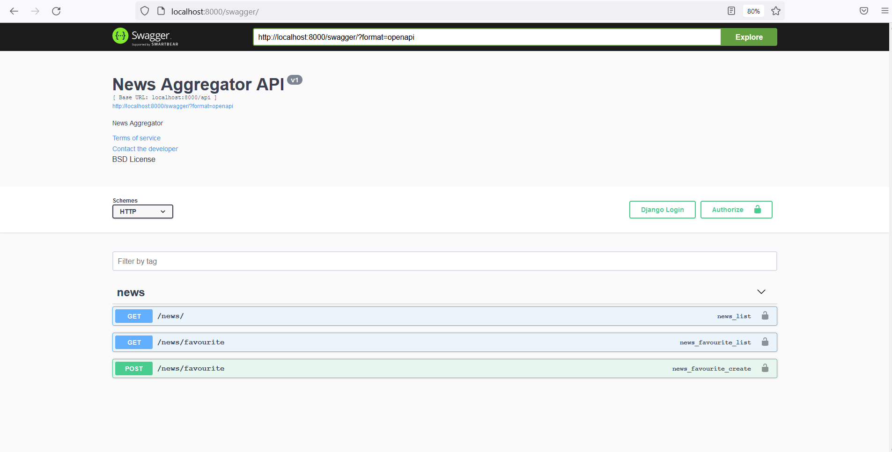
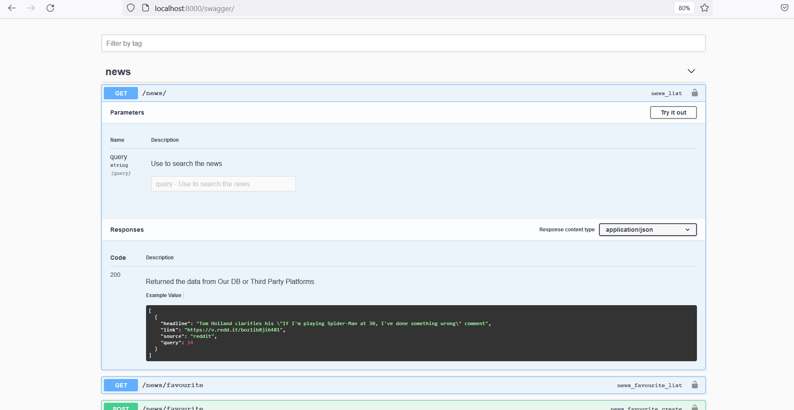
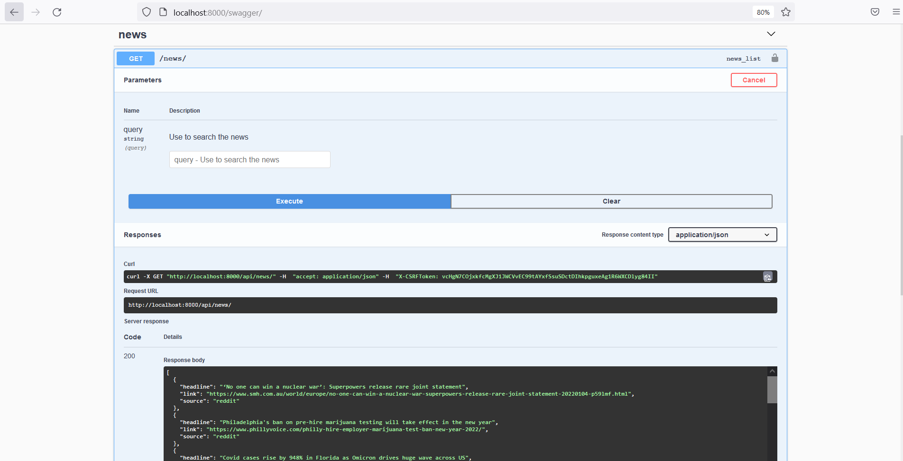
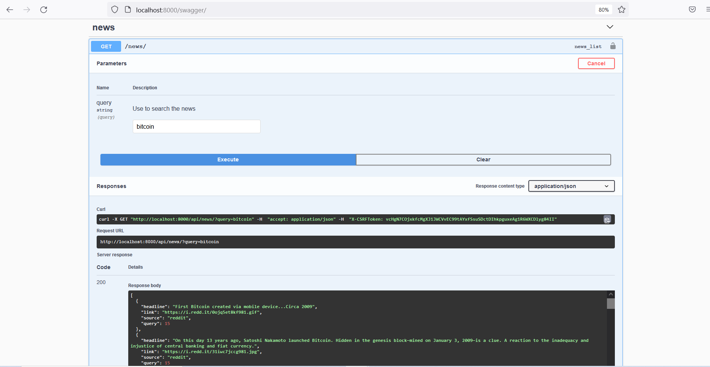
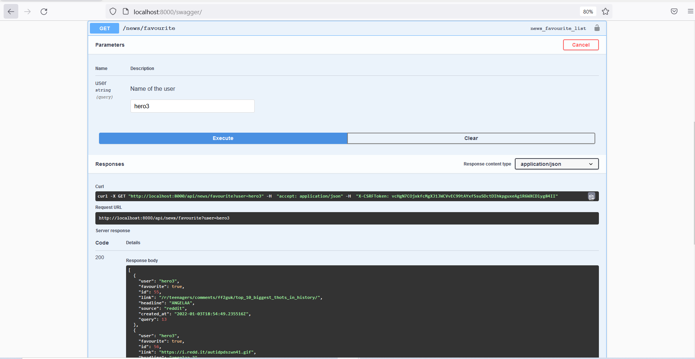
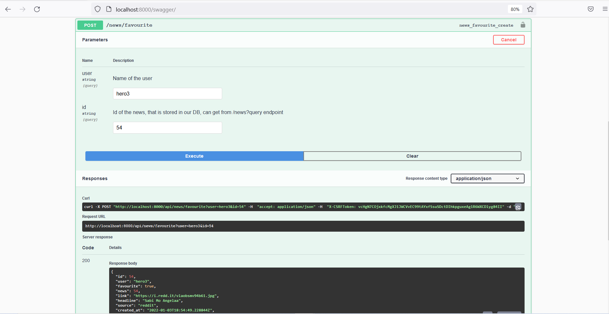

# News Aggregator

In this project, backend RESTful APIs are created where all the CRUD operations are running by using Django ORM to connect with the PostgreSQL Database. After succesfully running the project, a Swagger file is added to interact with the backend APIs which include methods GET and POST. This application aggregates news from two different APIs Reddite and TheNews, plus it stores the recent news into the DB and marke he favourite news for user

## How to run the application
1. Clone the respository into your local system
> git clone https://github.com/RamishUrRehman007/news-aggregator.git
2. Run the command to install all requirements
> pip install -r requirements.txt 
3. Run the following command to make migrations for DB but before that make sure you have DB into PostgreSql with name 'news_aggregator_project' and changed the username and password.
> python .\manage.py makemigrations 
> python .\manage.py migrate 
4. Now run the application .
> python  .\manage.py runserver           

5. Run "localhost:8000/swagger" on your browser to check if it is successful

6. Interact with the api 'news/' and 'news/?query='

6. Fetch all the favourite news of user by interacting 'news/favourite?user='

7. Mark the news favourite of user by interacting 'news/favourite?user=andid='

8. Unmark the news favourite of user by interacting the same urls with same params 'news/favourite?user=andid='

